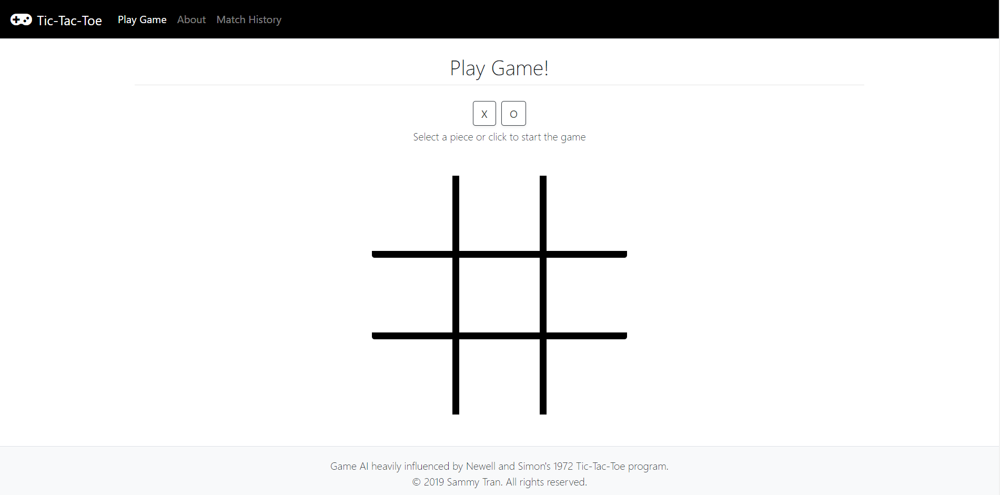
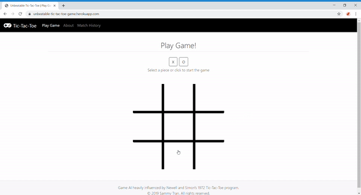
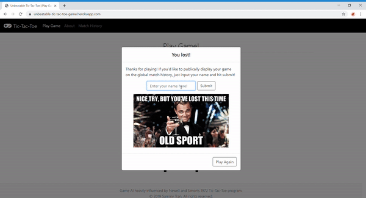
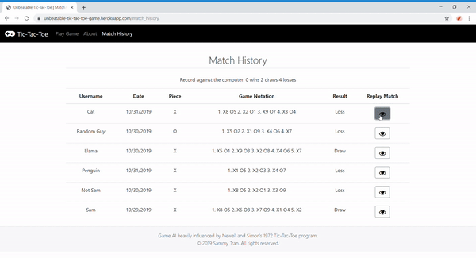

# **Unbeatable Tic-Tac-Toe**

# **Table of Contents**

 * [Introduction](#introduction)
 * [Learning Objectives](#learning-objectives)
 * [Link to Web App](#link-to-web-app)
 * [Site Features](#site-features)
 * [Technologies](#technologies)

## **Introduction**

Unbeatable Tic-Tac-Toe is a web application where users can play against a perfect tic-tac-toe engine (you can not win against it). Games that are played can be stored in a database and replayed by anybody. 

## **Learning Objectives**

The main goal of this project was to further develop my ability to use JavaScript by having to write JavaScript functions that manipulate the DOM, send AJAX requests, and handle user events. I was also interested in experimenting with production-level databases such as PostgreSQL and deploying my app using Heroku.

## **Link to Web App**

https://unbeatable-tic-tac-toe-game.herokuapp.com/

## **Site Features**

### **Play Against the Computer**

### **Submit Your Game**

### **Replay Previous Games**

## **Technologies**

### **Front-end Technologies**

  * HTML5
  * CSS3
  * JavaScript ES6
  * jQuery 3.4.1
  * Bootstrap 4.3.1

### **Back-end Technologies**

  * Python 3.7.2
  * Flask 1.1.1
  * Psycopg2 2.8.4
  * Gunicorn 19.9.0

### **Database Technologies**

  * PostgreSQL 12
  * pgAdmin 4

### **Other Notable Technology**

 * Heroku
